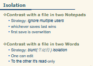
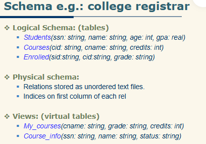
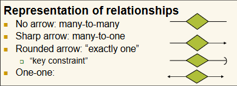
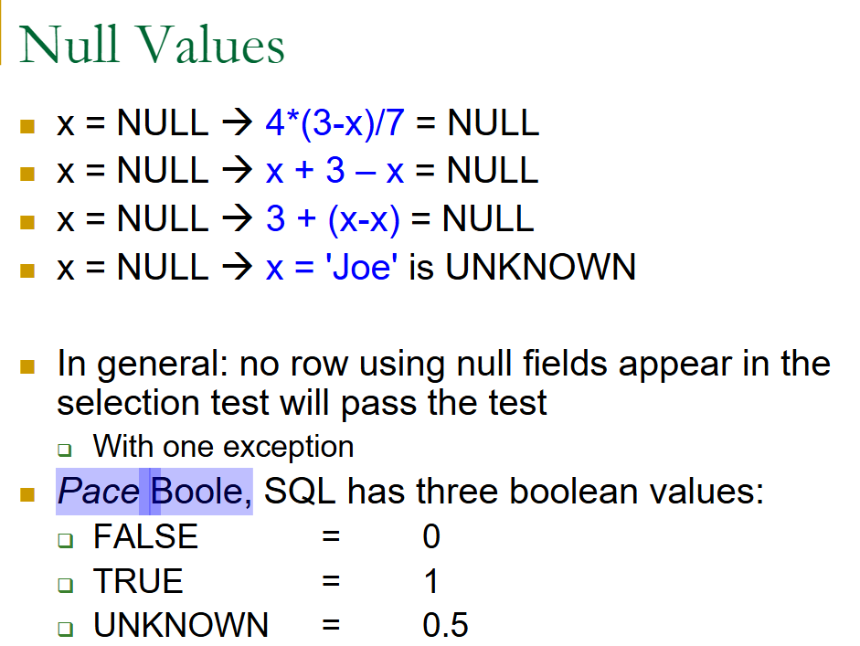

数据库(Datebase)

==Lecture 1==
1. **Introduction**
   - 是什么？Collection of data
   - 特性 properties
     - Atomicity 原子性：
       - entire xact is committed at once
       - all or nothing
     - Consistency 一致性:can define integrity constraints建立完整性约束
     - Isolation 孤立性
       - For each user, should look like a single-user system
        
     - Durability 持久性:changes stay made (with log…)
  
2. **Data Models**：collection of concepts for describing data
  - Relational data model: basically universal基本都通用

3. **Date Schema**数据模式：description of particular set of data, using some data model
  - physical schema:磁盘上的物理文件
  - logical schema：具有结构的关系/表集
  - external shchema(view)：为用户类型生成的虚拟表
  physical-->logical-->view-->appication
  

==Lecture 2==
4. **Entity Relationship (E/R) Model**
  - entity
  - entity set: 
    - set of one sort of entities
    - *Represented by a rectangle长方形*
  - attributes
    - *Represented by ovals椭圆形*
  - relationships
    - *Represented by diamonds菱形*
  - Subclasses 子类
    - *Represented by a triangle三角形*

  - Multiplicity of Relationships 关系的多样性
    - many-many
    - many-one
    - one-one
     

  - Design Issues
    - faithfulness 正确性
    - avoiding redundancy 避免冗余
    - simplicity
    - choice of relationships
    - picking elements
  - 主键(primary key):主键是数据库表中用来唯一标识每一条记录的字段或字段组合。主键的值不能重复，也不能为NULL，确保每条记录都能被唯一识别 

==Lecture 3==
1. **weak entity set** 弱实体集
  - 特征
    - 依赖性：**依赖**于强实体集
    - 主键(Primary key):没有单独的主键。一般通过与强实体的主键复合使用，形成复合主键
  - UML表示：弱实体通常用双矩形框表示
  - 示例
    - 强实体：student，主键是StudentID
    - 弱实体：student course，主键是(StudentID,CourseID)

2. **Constraints** 约束
  - **Single-valued** constraints
    - 只包含一个值(non-null)
  - **Referential integrity** 参照完整性
    - 外键约束：外键是一个表中的列，它应用另一个表中的主键。参照完整性要求外键的值必须在被引用表的主键中存在
    - 防止孤立记录：确保任何引用的的记录在主表中都必须存在，防止无效引用
    - 删除和更新原则：
      - CASCADE延续性：如果主表中的记录被删除或更新，相关的外键记录也会被自动删除或更新
      - SET NULL：如果主表中的记录被删除或更新，相关的外键字段将被设置为NULL
      - RESTRICT：如果仍有外键引用存在，则不允许删除或更新主表中的记录
    - 示例：假设有两个表：Customers（客户表）和 Orders（订单表）。在 Orders 表中，有一个外键 CustomerID，引用 Customers 表的 CustomerID。这意味着每个订单都必须对应一个存在的客户，以保持参照完整性。
  - Domain constraints:日期的数字限制，成绩的字母限制
  - General constraints:A class may have no more than 100 students; a student may not have more than 6 courses

3. **Relational Data Model**关系数据模型
  - Relational terminology术语
    - Relation is composed of tuples(元组)
    - *Tuple* = sequence(序列) of attribute values
    - Relation Schema:relation name + attribute names + attribute types
    - Database schema: set of relation schemas

4. **From E/R models to relations**
  - justification理由：用E/R(如C/java)设计更简单，但用R(byte code)来实现更简单
  - rules 
    - Relationship → relation
    - Entity set(==实体集==) →  relation(==关系==)
  - examples
    - students:name,age,address ->relation:students
    - students——enroll——course  ->relation:enroll
      - key:keys of both entities
    - studios——own——movies ->relation: 根据需求确定
  
==Lecture 4==
1. **Functional dependencies** 函数依赖
  - 果属性集A的值确定了属性集B的值，则称B函数依赖于A，记作A → B
  - FDs are constrains
  - Finding all FDs is part of DB design:used in normalization
  - Definition:如果在一个关系数据库中，对于任意两个元组（记录），如果元组 A 的某个属性集 X 的值唯一地确定了元组 B 的某个属性集 Y 的值，我们称 Y 是依赖于 X，表示为 ( X \rightarrow Y )。
  - 唯一性：属性集( A1A2A3…An ) 是关系 ( R ) 的一个键，意味着它可以唯一地确定关系中的所有其他属性。
  - 最小性：最小候选键，属性集作为键必须是最小的。
    - **示例**：学生表属性包括：StudentID,Name,email。假设StudentID是唯一的，能够确定其他属性。
      - 键：StudentID->{Name,email}
      - 最小性：不能用Name来确定其他属性，因为可能又多个学生同名。因此SturdentID是最小候选键
  - **超键**（superkey）：一个属性集，它能够唯一标识关系中的每一行(每个属性的值都是唯一可确定的)，为了确保唯一性，可以有复合超键。
    - **唯一性**：超键的值在关系中是唯一的
    - 包含性：每个候选键都是超键，但不是每个超键都是候选键。超键还可以包含多余属性
      - 如上面的例子，StudentID,Name,email都是超键，但Name不是候选键
  - 关系与二元关系
    - many-many：关系的键是两个实体集的键的并集
    - many-one：关系的键是“many”的键
    - one-one：关系的键可以是任意一方的键，但不能同时使用两者（会导致冗余）
  - rules
    - FD 集合 ( T ) 跟随于 ( S ) 当且仅当每个满足 ( S ) 的关系实例也满足 ( T ) 
    - FDs ( S ) 和 ( T ) 等价，当且仅当它们相互推导
    - 推广
      - 只能分后面，不能分前面
      - 组合规则：A->B,A->C then A->BC
      - 分割规则：AB->CD then AB->C,AB->D
      - 增强规则：A->B then AC->BC
                 A->B then AC->B 
      - 传递规则：A->B,B->C  then A->C
      - 自反规则(线性代数类似)：
        - 平凡函数依赖trivial FD:B是A的子集
        - 非平凡函数依赖nontrivial FD：B至少有一个属性不在A中
        - 完全非平凡的函数依赖completely Nontrivial FD:B中的所有属性都不在A中
        - AB->A (属性集决定子集)
        - 平凡消除规则：可以在箭头前消除公共属性
          - AB->AC then B->C
          - ABC->AB then C->AB
          - ABC->B then AC->B
        - ==但是这样很多规则太复杂了，所以引入**闭包算法**==
          - 考虑R(A,B,C,D),并且有以下FD：
            A->B
            B->C
            A->D
          - 我们想计算属性集 \( \{A\} \) 的闭包 \( \{A\}^+ \)
          - 步骤
            - 初始化：闭包初始为 \( \{A\}^+ = \{A\} \)
            - 检查依赖：
              -  ( A -> B )：( A ) 在闭包中，所以添加 ( B )。现在闭包变为 ( {A, B} )。
              - ( B -> C )：( B ) 在闭包中，所以添加 ( C )。现在闭包变为 ( {A, B, C} )。
              - ( A -> D )：( A ) 在闭包中，所以添加 ( D )。现在闭包变为 ( {A, B, C, D} )。
            - 重复：再次检查，没有新的属性可以添加
            - 结果：\( \{A\}^+ = \{A, B, C, D\} \)。这意味着属性 \( A \) 可以决定关系模式中的所有属性

2.  Anomalies 异常
  - 异常的种类
    - 冗余
    - 更新异常 update anomalies
    - 删除异常 deletion anomalies
    - 插入异常 insert anomalies
  - 解决方法：投影分解 Projection for decomposition，消除一些属性，使之变为normal form
  - what is good design
    - no anomalies
    - Can reconstruct all (and only the) original information
  - terminology术语
    - Projection 投影：eliminating certain atts from relation
    - Decomposition：separating a relation into two by projection
      - 有损lossy：分解后，通过连接操作无法恢复原关系表中的某些行，或者恢复的信息不完整
      - 无损lossless：如果通过连接操作，能够确保原关系表中的所有行都能被完整地恢复
        - 怎么确保无损：
           对R(Ai,Bi,Ci),分解为R1(Ai,Bi),R2(Ai,Ci)若有A->B or A->C，则无损  

3.  **normal form**
  - 1NF 第一范式
    - 要求数据库表中的每个字段都必须是原子值，**不能有重复**的列和多值字段。每行数据必须唯一
 
  - 2NF 第二范式
    - 第二范式要求首先满足第一范式，且所有非主属性必须**完全依赖于主键**，不能有部分依赖
  
  - Third Normal Form第三范式
    - 第三范式要求首先满足第二范式，并且所有非主键属性之间不能有传递依赖。也就是说，非主键属性只能**直接依赖**于主键，而不能依赖于其他非主键属性
    - 例：==学生ID==	学生姓名	班级	班主任 ，班主任通过班级间接依赖学生ID，所以要拆分数据，变为：学生ID	学生姓名	班级
          班级	班主任  

  - Boyce Codd Normal Form（简称**BCNF**）
    - 定义：是第三范式的加强版，所有的函数依赖都必须是由**超键**决定的。
      即： If a set of attributes determines other attributes, it must determine all the attributes
    - 优点：
      - 提高数据一致性
      - 减少异常：避免插入删除和更新异常
        - 如果类别名称需要更新，我们只需要在类别表中进行一次修改，而不需要在多个借阅记录中进行多次修改 
  
  - 规范覆盖(Canonical Cover)：用于精简和规范化一组函数依赖
    - F:A->BC      F_c:A->B
        A->B           A->C
        A->C 
    - F:PQR->S     F_c:P->S
        P->S           QR->S
        QR->S
        

==Lecture 6==
  - Formal Relational Query Languages 形式相关查询语言
    - Relational Algebra关系代数
      - 选择 (σ)：从关系中选择符合特定条件的行，类似于对数据的“筛选”，这是一个水平操作。
      - 投影 (π):从关系中保留特定的列，只提取所需的字段，类似于对数据的“精简”，这是一个垂直操作。
      - 笛卡尔积 (×)：将两个关系结合，生成一个包含所有可能组合的新的关系。
      - 集合差 (−)：返回在关系 ( r_1 ) 中存在但在关系 ( r_2 ) 中不存在的元组。
      - 并集 (∪)：返回在关系 ( r_1 ) 或 ( r_2 ) 中存在的所有元组，合并两个关系的内容
      - 交集(∩):只取共同的
      - 自然连接(⨝):识别两个表中相同名称的列，并对这些列的值进行匹配，只返回那些在这两个表中都存在的行。
      - division operation(除法)：用于从一个表中筛选出那些与另一个表中的所有记录都有关系的记录
  
    - Relational Calculus关系演算
      - p(T)是一个公式，T是一个元组变量，要求T是p(T)中唯一的自由变量(∀)，其他的变量都要是约束变量(有范围限制)
    
12. SQL(Structured Query Language)结构化查询语言
    非过程化、可独立用于联机交互、可嵌入到高级语言中
    - 子语言
     - DDL：Data Definition Language
     - DML：Data Manipulation Language
    - **SQL语言的动词**
      - 数据查询——SELECT
      - 数据定义——CREATE、DROP、ALTER
      - 数据操控：INSERT、UPDATE、DELETE
      - 数据控制——GRANT、REVOKE(撤回)
    - 字符类型
      - CHAR 固定长度字符型
      - VARCHAR 可变长度字符型
    - 数字类型 
      - bigint integer smallint tinyint 
      - real(单精度浮点数) float(双精度浮点数) 
      - money(货币类型，用于存储货币值)
    - 日期和时间类型
      - DATE：存储日期部分（年月日）
      - DATETIME：存储日期和时间的组合（年月日时分秒）
    - 关系代数(RA)与SQL
      - **SELECT** → RA Projection P（投影），选出所需的列
      - **WHERE** → RA Selection s（选择），提取满足条件的元组
      - **FROM** → RA Join/Cross（连接或笛卡尔积）
      - SQL 重命名 → RA rho(ρ) r，对表或者列进行重命名
      - 查询结构
      ```
      SELECT [DISTINCT] target-list
      FROM relation-list
      WHERE qualification
      
      ```
      DISTINCT确保结果中不会有重复记录
        - 例子
          假设有一个员工表 employees，你想要查询所有不同的员工姓名和年龄，且年龄大于30岁，可以写成：
          SELECT DISTINCT name, age
          FROM employees
          WHERE age > 30;
      - 查询语义
        - 并行赋值    
        - 嵌套循环
      - 高级SQL查询
        - 查询多重关系
          SELECT S.sname
          FROM Sailors S, Reserves R
          WHERE S.sid=R.sid AND R.bid=102
      - 范围变量
        用于解决可能出现的歧义，尤其是在同一张表被多次引用时，例如进行“自连接”（self-join）时
        SELECT x.sname, x.age, y.sname, y.age
        FROM Sailors x, Sailors y
        WHERE x.age > y.age;
      - 算数表达式
        SELECT S.age, S.age-5 **AS** age1, 2*S.age **AS** age2
        FROM Sailors S
        WHERE S.sname = ‘dustin’
      - 字符串比较
        SELECT S.sname
        FROM Sailors S
        WHERE S.sname LIKE ‘B_%B’ 
        - “_"表示任意一个字符
        - % 表示零个或多个任意字符
        - SELECT *表示从表中选择所有列的数据
      - 嵌套查询
        SELECT S.sname
        FROM Sailors S
        WHERE S.sid IN
        (SELECT R.sid
        FROM Reserves R
        WHERE R.bid=103)
      - 分组与聚合GROUPING AND AGGREATION
        SELECT COUNT(category)
        FROM Product
        WHERE year > 1995;  最终返回的是数字

        SELECT category, COUNT(category) AS count
        FROM Product
        WHERE year > 1995
        GROUP BY category;  最终返回符合要求的每个类别的名称和其对应的数量
      - 查询结果排序
       在 SQL 中，使用 **ORDER BY** 子句对查询结果进行排序。通过 ORDER BY，您可以指定要排序的列以及排序顺序（升序或降序）。
        **语法**
          SELECT S.rating, S.sname, S.age
          FROM Sailors S, Boats B, Reserves R
          WHERE S.sid = R.sid
          AND R.bid = B.bid 
          AND B.color = 'red'
          ORDER BY S.rating ASC, S.sname ASC;
          ASC: 升序排列（默认）。
          DESC: 降序排列。
      - NULL in SQL
       
        - 布尔表达式中的null值
          任何涉及 NULL 的表达式通常会导致 NULL 或 UNKNOWN，强调真值是不确定的
          - 可以说x IS NULL;  X IS NOT NULL; 
            不能说x=NULL
      - 连接
        - INNER JION
        - LEFT OUTER JOIN
        - RIGHT OUTER JOIN
            SELECT a.column1, b.column2
            FROM table_a a
            **RIGHT OUTER JOIN** table_b b **ON** a.id = b.a_id;
        - FULL OUTER JOIN
      - 视图（view）
        - 视图（View）是一种虚拟表，它是基于查询结果而生成的。视图可以简化开发、增强安全性，并且不占用额外的存储空间
        - 示例：创建视图
          **CREATE VIEW** *Reds* **AS**
          SELECT B.bid, COUNT(*) AS scount
          FROM Boats B, Reserves R
          WHERE R.bid = B.bid AND B.color = 'red'
          GROUP BY B.bid;
          一旦视图被创建，就可以像查询常规表一样查询它：
          SELECT * FROM *Reds*;
      - 自主访问控制（Discretionary Access Control, DAC）:一种数据库权限管理方法
        - 授予权限：
          - 语法：**GRANT** privileges **ON** object **TO** users [WITH GRANT OPTION];
          - 对象可以是表或者视图
          - 例子：GRANT SELECT ON Employees TO UserA;
        - 权限类型：
          SELECT：允许读取表或视图中的数据。
          INSERT：允许向表中添加新行。
          DELETE：允许从表中删除行。
          REFERENCES（列）：允许创建外键，引用指定的列。
          ALL：授予对象的所有可用权限。 
        - 用户可以是单个用户或者用户组
        - **WITH GRANT OPTION** 子句允许被授予权限的用户进一步将这些权限授予其他用户
        - 撤销权限
          - 语法：REVOKE privileges ON object FROM users;
          - 例子：REVOKE INSERT ON Orders FROM UserB;
      - 完整性约束 Integrity Constrains
        CREATE TABLE Sailors (
            sid INTEGER,
            sname CHAR(10),
            rating INTEGER,
            age REAL,
            **PRIMARY KEY** (sid), //主键约束
            **CHECK** (rating >= 1 AND rating <= 10)
        );    //检查约束
      - 嵌入式SQL：允许在主机编程语言中嵌入 SQL 语句，从而实现应用程序代码与数据库之间的无缝交互
        - 游标(cursor):允许逐行从查询结果集中获取行
          - 声明
           **EXEC SQL DECLARE** my_cursor **CURSOR FOR**
           **SELECT** column1, column2 **FROM** my_table;
          - 打开：声明后，必须打开游标以执行查询 
           **EXEC SQL OPEN** my_cursor;
          - 获取行
           **EXEC SQL FETCH** my_cursor **INTO** :host_var1, :host_var2;
          - 关闭
           **EXEC SQL CLOSE** my_cursor;
      - 数据库API（应用程序编程接口，Application Programming Interface）：嵌入式 SQL 的替代方案
        - 与其修改编译器，不如添加一个包含数据库调用的库提供特殊的对象和方法；允许通过编程语言传递 SQL 字符串。
        - 架构概述
          - 过程
            映射数据源名称（DSN）到驱动程序->
            应用程序运行时，根据提供的DSN链接适当的驱动程序->
            驱动程序拦截应用程序发出的调用，并将其翻译成特定数据库管理系统（DBMS）可理解的命令
            **即驱动程序充当中介，能够理解应用程序的请求和数据库的需求**
          - 该架构支持远程访问位于网络上的数据库
        - ODBC（开放数据库连接）：ODBC是一种标准API，允许应用程序以**一致的方式**与各种数据库系统进行通信。理论上，相同的程序可以通过更改DSN来连接不同的数据库（例如Oracle、MySQL、SQL Server）
          - 数据源的灵活性：还可以连接到非SQL数据源
        - JDBC（Java 数据库连接）


         