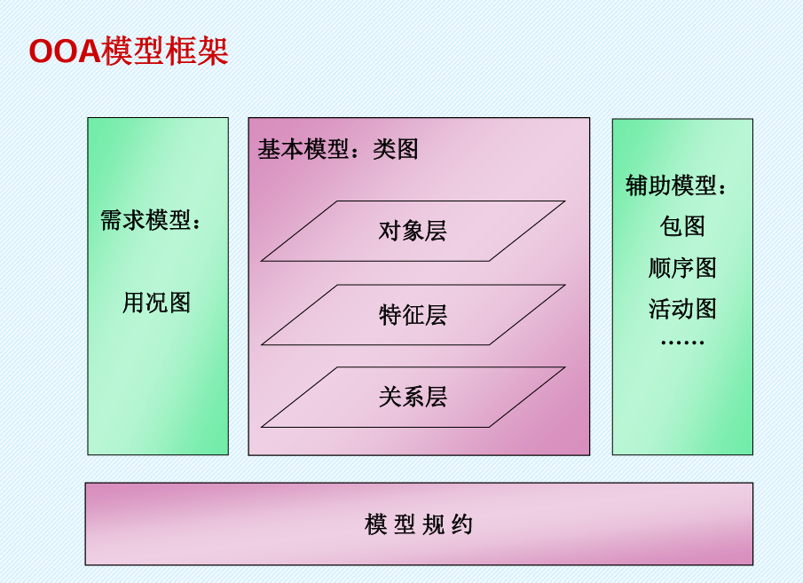

软件工程方法论

1. 基础篇
   1. 不同的分析与设计方法
     - 功能分解法   
       以功能为中心
       - 优点：直接反映需求
       - 缺点：不能直接反映问题域
     - 结构化方法
       跟踪数据流
       - 概要设计：得到模块结构图
       - 详细设计：每个模块内部的数据结构和操作流程

       - 优点：研究的是问题域
       - 缺点：
     - 信息建模法
       核心概念是实体（对象）和关系

     - ==面向对象方法==
       直接映射问题域
       - OOA、OOD
      
     - UML(统一建模语言)
       - 构成部分
         - 概要
         - 语义
         - 表示法指南
         - 外廓范例
         - 模型交换
         - 对象约束语言
          
       - 9种模型图
         - 静态结构图
           - 类图
           - 对象图
           - 用况图
         - 交互图
           - 顺序图
           - 协作图
           - 状态图
           - 活动图
         - 实现图
           - 构件图
           - 部署图  
          
       - 扩展机制
         - 约束：说明必须为真的命题
         - 注释
         - 标记值：表示模型元素的附加特征
         - 衍型：将原有元素定制成语义特殊的新变种
     - UML2
       - 概况
         -  四个规范
           - 基础结构
           - 上层结构
           - 图交换（interchange）
           - 对象约束语言
         - 13种模型图
         
           - 结构图
             - ==类图==
             - 组合结构图
             - ==构件图==
             - 部署图
             - 对象图
             - 包图
           - 行为图
             - ==活动图==
             - ==用况图==
             - ==状态机图==
             - 交互图
               - ==顺序图==
               - 通讯图
               - 交互概览图
               - 定时图 
               

    2. OOA&D的方法概貌
      - 主要概念         
        - 建模元素
          - 对象、类
          - 属性、操作
          - 一般-特殊关系、结构，整体-部分关系、结构
          - 关联
          - 消息（控制流内部或相互之间的消息
        - 主要原则
          - 抽象
          - 分类
          - 封装
          - 继承
          - 聚合
          - 关联
          - 消息通信
          - 粒度控制：把模型中的类按一定的规则进行组合，形成一些包
          - 行为分析
    3. 模型及规约
      - 基本模型——类图
      - 需求模型——用况图
      - 辅助模型——其他各种图（包图、顺序图、活动图） 

      - 模型规约：对以上模型图的详细定义和解释
    
    
    
    

2. 分析篇
  - 需求分析和系统分析
  - 设计基本思路：描述清楚内外交互情况，就确切地定义了系统的需求
    - 参与者：人员、设备、外系统
  - 用例（use case）
    - 陈述参与者和系统在交互过程中双方所做的事  
    - 描述彼此为对方直接地做什么事，不描述怎么做
    - 描述应力求准确，允许概括
    - 一个用况可以由多种参与者分别参与或共同参与
    - 通常是平铺直叙的文字描述
    - 
    - 
  - 接口：是由一组操作所形成的一个集合，它由一个名字和代表其中每个操作的特征标记构成。  
  - 消息：
  

  1. 设计篇
    - 文件系统
      - 优点：可存储任何类型的数据，如图像影音
      - 缺点：操作低级
    - 数据库管理系统(DBMS):用于建立、使用和维护数据库的软件
      - 数据库：长期存储在计算机内、有组织、可共享的数据集合
      - 关系数据库管理系统 RDBMS：一组域的笛卡尔积就是一个关系，又称二维表。每一列称作一个属性，每一行称作一个元组
        - 缺点：不能直接有效地组织和存储对象数据
      - 面向对象数据库管理系统 OODBMS：具有数据库管理系统的功能
